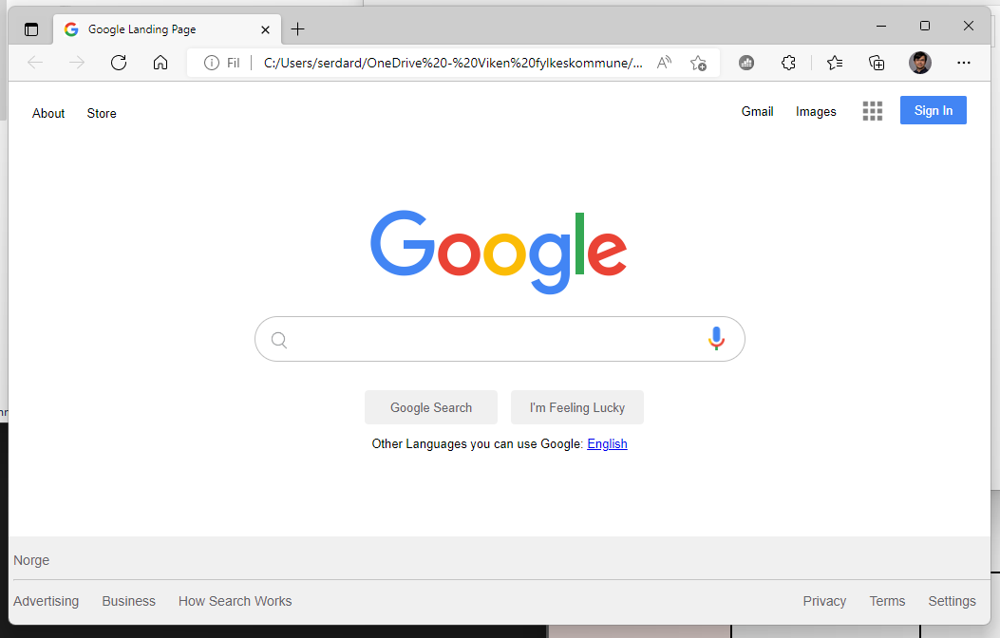

<h1 align="center">Google Homepage Kopi </h1>

  <h3>
    <a href="https://github.com/HTMLkrigeren/GoogleHomePage">
      Lenken til prosjektet
    </a>
  </h3>

## Table of contents
- [Overview](#Overview)
- [Built With](#Built-with)
- [Features](#features)
- [How to use](#how-to-use)
- [Contact](#contact)
- [Forventet resultat og resultat](#forventet-resultat)
## Overview
 En kopi av Google sin netside.
## Built with
 .1 HTML
 .2 CSS
## Features

## How To Use
HTML
- https://css-tricks.com/snippets/css/a-guide-to-flexbox/
- https://css-tricks.com/snippets/css/a-guide-to-flexbox/
- https://css-tricks.com/snippets/css/a-guide-to-flexbox/
CSS 
- https://css-tricks.com/snippets/css/a-guide-to-flexbox/
- https://css-tricks.com/snippets/css/a-guide-to-flexbox/
- https://css-tricks.com/snippets/css/a-guide-to-flexbox/
Youtube
https://www.youtube.com/watch?v=phWxA89Dy94

## Contact
- GitHub [HTMLkrigeren](https://github.com/HTMLkrigeren)

## License
Det er gratis (MIT licesse)
## Documentation
dette prosjektet er kun bygget med HTML og CSS, ikke noe JS som gjør at den har null funksjoner.
## Forventet resultat

## Resultat

